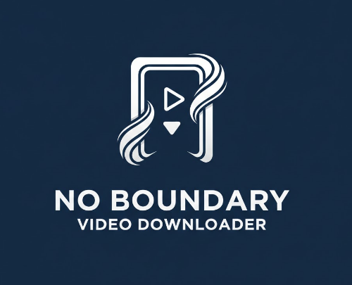

🎬 No Boundary Video Downloader

  

🇹🇷 Hikayesi Ne?
İnternetten ne zaman uzun bir video indirmek istesem karşıma hep aynı engeller çıktı: "2 saatten uzun video indiremezsin", "Şu boyuttan büyükse olmaz", "HD kalite için premium satın al" ya da her yerinden reklam fışkıran o yavaş siteler...

Bir bilgisayar mühendisliği öğrencisi olarak bu kısıtlamalardan sıkıldım ve kendi çözümümü üretmeye karar verdim. No Boundary, bu sınırları aşmak ve tertemiz bir indirme deneyimi yaşamak için doğdu. Uzun zamandır kendi bilgisayarımda manuel (kod üzerinden) kullanıyordum, ancak artık herkesin rahatça kullanabilmesi için bir .exe haline getirmenin vakti gelmişti.

🚀 Nasıl Çalıştırılır?
İndir: Buraya tıklayarak güncel .exe dosyasını indirin.

Çalıştır: main.exe dosyasına çift tıklayın. (İçinde her şey dahil; ne Python ne de FFmpeg kurmanıza gerek var, her şeyi ben hallettim!)

Keyfini Çıkar: Linki yapıştırın, klasörü seçin ve arkanıza yaslanın.

⚡ Neden Bunu Kullanmalısın?
Sınırları Zorla: 2 saatmiş, 10 saatmiş fark etmez; hiçbir süre veya boyut sınırı yok.

Tertemiz: Reklam yok, "premium al" baskısı yok. Sadece işini yapar.

Tak-Çalıştır: FFmpeg uygulamanın içine gömülüdür, dışarıdan hiçbir bağımlılık istemez.

Hızlı: Threading yapısı sayesinde videoyu hızla indirir ve birleştirir.

🇺🇸 The Story Behind
Whenever I wanted to download a long video, I faced the same annoying walls: "Videos over 2 hours not allowed", "File size too large", "Pay for HD quality", or those sketchy websites overflowing with ads.

As a computer engineering student, I got tired of these limits and decided to build my own way out. No Boundary was born to crush these restrictions and provide a seamless downloading experience. I've been using it manually for a while, but I figured it was finally time to bundle it into an .exe and share it with everyone.

🚀 How to Run
Download: Get the standalone .exe right here.

Run: Just double-click main.exe. (Everything is pre-bundled; no Python or FFmpeg installation required—I've got you covered!)

Enjoy: Paste the URL, choose your path, and let it rip.

⚡ Why No Boundary?
No Limits: 2 hours? 10 hours? It doesn't matter. Total freedom.

Ad-Free: No clutter, no "Go Pro" pop-ups. Just pure code.

All-in-One: FFmpeg is built-in for a true portable experience.

High Speed: Uses threading to fetch and merge your videos as fast as possible.

⚠️ Küçük Bir Not / A Quick Note
TR: Uygulama henüz sertifikalı bir yazılım olmadığı için Windows çalıştırırken bir uyarı verebilir. Açık kaynak kodlu ve güvenlidir; "Ek Bilgi" -> "Yine de Çalıştır" diyerek geçebilirsiniz.

ENG: Since the .exe is not digitally signed, Windows might show a warning. It's open-source and safe; just click "More Info" -> "Run Anyway" to start.
